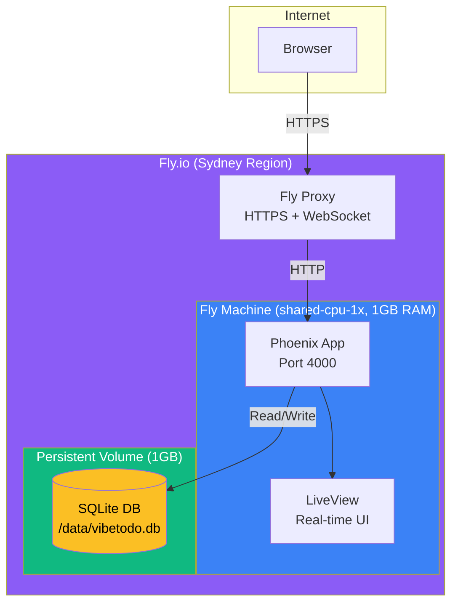

# Deployment

Vibetodo is deployed on Fly.io with SQLite persistence.

## Architecture



## Components

| Component | Technology | Purpose |
|-----------|------------|---------|
| Web Framework | Phoenix 1.8 | HTTP handling, routing |
| Real-time UI | LiveView | WebSocket-based reactive updates |
| Database | SQLite + Ecto | Persistent storage |
| Hosting | Fly.io | Edge deployment, auto-sleep |
| Storage | Fly Volume | Persistent disk for SQLite |

## Details

- **Region:** Sydney (syd)
- **Auto-sleep:** VMs sleep after ~5min idle, wake on request (~2-3s)
- **URL:** https://vibetodo.fly.dev
- **Data:** Persisted on Fly Volume, survives restarts

## Commands

```bash
# Deploy
fly deploy

# View logs
fly logs

# SSH into VM
fly ssh console

# Check app status
fly status
```

## Configuration Files

- `fly.toml` - Fly.io app configuration
- `Dockerfile` - Container build instructions
- `rel/` - Release scripts (server, migrate)
